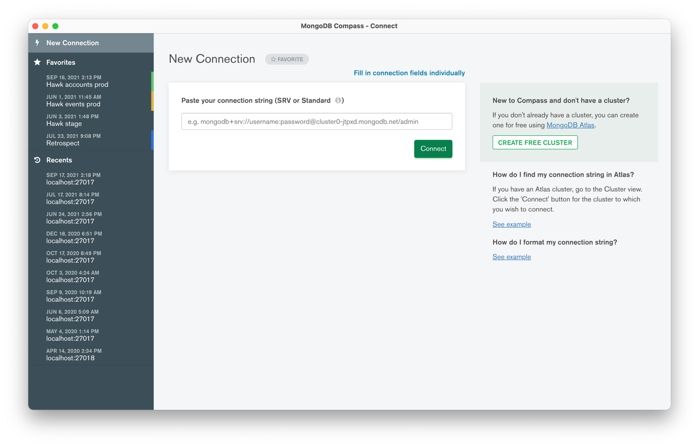
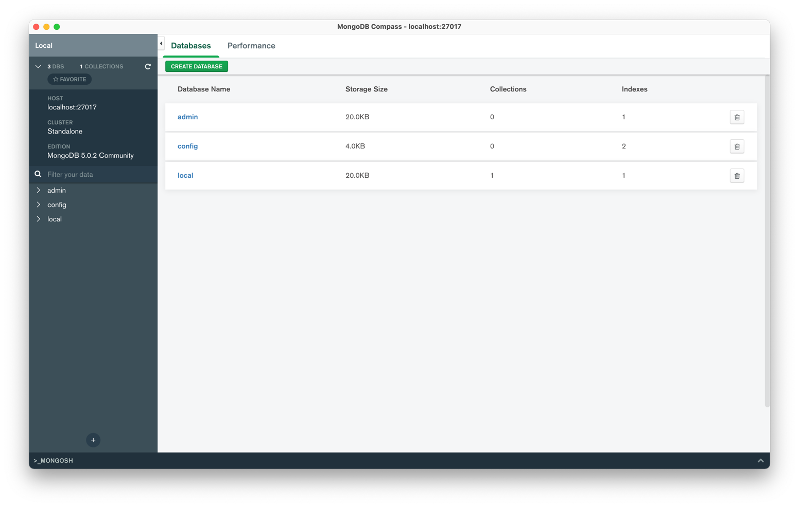
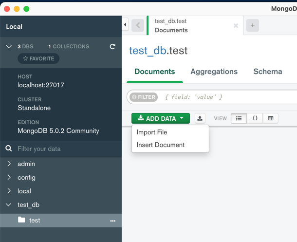
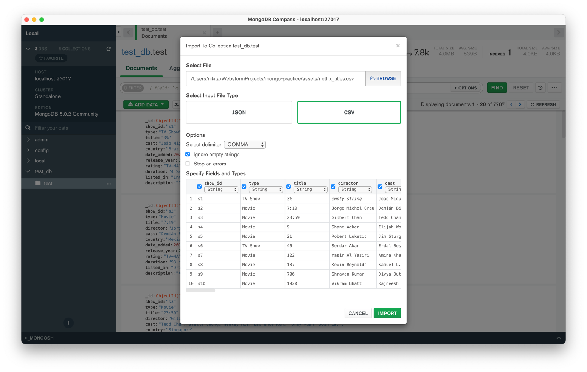
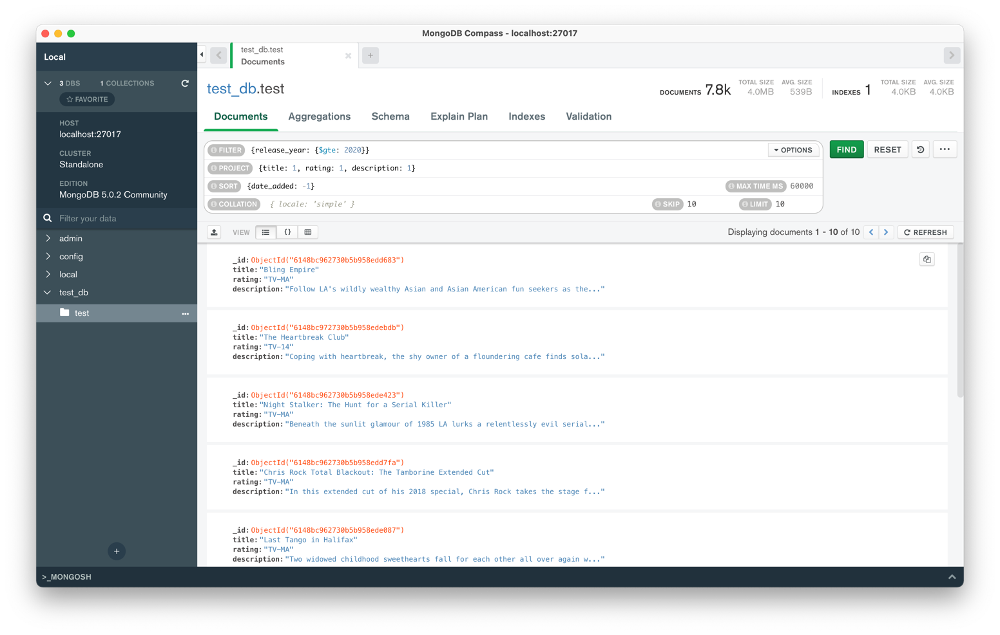
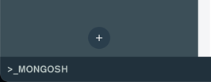

# Lecture 2. MongoDB Shell basics

## Connect to a MongoDB instance

If you install MongoDB on your local machine without Docker, then simply type in terminal the following command (assuming that your run MongoDB on `localhost` on port `27017`)
```shell
mongosh
```

Docker-way:
```shell
docker-compose exec mongodb mongosh
```

If you run MongoDB on different host or port, then run the following command:
```shell
mongosh "mongodb://localhost:27017"
```

Read more in [docs](https://docs.mongodb.com/mongodb-shell/connect/).

## Basic shell commands

Display help with command description
```shell
help
```

Switch to another DB (it will create a new one if it doesn't already exist)
```shell
use mydb
```

Read more about basic shell commands in [docs](https://docs.mongodb.com/mongodb-shell/crud/)

### Documents inserting

**NOTE**: Documents in MongoDB are JSON (more specifically, its extension is [BSON](https://www.mongodb.com/json-and-bson)). It assumes that you are familiar with the JSON format.

**NOTE**: All collection-specific operations has the following syntax `db.<collection_name>.<command_name>()`. You can also access collection with following command: [db.getCollection()](https://docs.mongodb.com/manual/reference/method/db.getCollection)

Insert one document (with autogenerated `_id` field):
```javascript
db.movies.insertOne(
  {
    title: "The Favourite",
    genres: [ "Drama", "History" ],
    runtime: 121,
    rated: "R",
    year: 2018,
    directors: [ "Yorgos Lanthimos" ],
    cast: [ "Olivia Colman", "Emma Stone", "Rachel Weisz" ],
    type: "movie"
  }
)
```

Get all documents from `movies` collection:
```javascript
db.movies.find()
```

Insert array of documents:
```javascript
db.movies.insertMany([
   {
      title: "Jurassic World: Fallen Kingdom",
      genres: [ "Action", "Sci-Fi" ],
      runtime: 130,
      rated: "PG-13",
      year: 2018,
      directors: [ "J. A. Bayona" ],
      cast: [ "Chris Pratt", "Bryce Dallas Howard", "Rafe Spall" ],
      type: "movie"
    },
    {
      title: "Tag",
      genres: [ "Comedy", "Action" ],
      runtime: 105,
      rated: "R",
      year: 2018,
      directors: [ "Jeff Tomsic" ],
      cast: [ "Annabelle Wallis", "Jeremy Renner", "Jon Hamm" ],
      type: "movie"
    }
])
```

Read more [here](https://docs.mongodb.com/mongodb-shell/crud/insert/).

### Documents updating

Update command has the following syntax: `db.collection.updateOne({filter}, {update_operator})`, where `filter` declares which documents you want to update and `update_operator` declares how you want to update doc.

Update document `plot` field:
```javascript
db.movies.updateOne( { title: "Tag" },
{
  $set: {
    plot: "One month every year, five highly competitive friends hit the ground running for a no-holds-barred game of tag"
  }
})
```

Update all documents that satisfy the filter:
```javascript
db.listingsAndReviews.updateMany(
  { security_deposit: { $lt: 100 } },
  {
    $set: { security_deposit: 100, minimum_nights: 1 }
  }
)
```

Replace entire content of the document:
```javascript
db.accounts.replaceOne(
  { account_id: 371138 },
  { account_id: 893421, limit: 5000, products: [ "Investment", "Brokerage" ] }
)
```

Read more [here](https://docs.mongodb.com/mongodb-shell/crud/update/).

### Documents deleting

Delete all document:
```javascript
db.movies.deleteMany({})
```

Delete one document that matches the criteria:
```javascript
db.movies.deleteOne( { cast: "Brad Pitt" } )
```

Read more [here](https://docs.mongodb.com/mongodb-shell/crud/delete/).


### Documents querying

Use `db.collection.find(filter)` command to query documents. The `filter` option declares which documents you want get.

Get the eleventh document from the beginning of the collection
```javascript
db.test.find().limit(1).skip(10)
```

Get documents count that matches the criteria (in this case filter matches all documents)
```javascript
db.test.find().count()
```

Read more in docs [here](https://docs.mongodb.com/mongodb-shell/crud/read/), and [here](https://docs.mongodb.com/manual/reference/method/db.collection.find/)

## Importing datasets

**NOTE**: in this lecture I used the following datasets from [kaggle.com](https://kaggle.com): [one](https://www.kaggle.com/shivamb/netflix-shows), [two](https://www.kaggle.com/datasnaek/youtube-new?select=USvideos.csv).

Import CSV file to MongoDB
```shell
mongoimport -c test_collection -d test_db --type=csv --headerline --file=./assets/netflix_titles.csv
```

Import CSV file to MongoDB (will not work on Windows)
```shell
cat ./assets/netflix_titles.csv | mongoimport -c test_collection -d test_db --type=csv --headerline
```

The same command for importing (will work on all OS, but requires mounting additional volume to MongoDB Docker container, see [here](../docker-compose.yml))
```shell
docker-compose exec mongodb mongoimport -c test_collection -d test_db --type=csv --headerline --file=/assets/netflix_titles.csv
```

Importing JSON file from standard input (not working on Windows)
```shell
cat ./assets/YouTubeDataset_withChannelElapsed.json | docker-compose exec -T mongodb mongoimport -c test_collection -d test_db_new --jsonArray
```

Import JSON file with Docker Compose
```shell
docker-compose exec mongodb mongoimport -c test_collection -d test_db_new --jsonArray --file=/assets/YouTubeDataset_withChannelElapsed.json
```

Read more about [mongoimport](https://docs.mongodb.com/database-tools/mongoimport/) here.

## MongoDB Compass

### Installation

Download [here](https://docs.mongodb.com/compass/current/install/).

### Connecting

On launch, you will the following window: 



By default, MongoDB compass tries to connect on `mongodb://localhost:27017`. If you have not changed the default MongoDB settings, you can simply click the "connect" button.

Read more about URI format [here](https://docs.mongodb.com/manual/reference/connection-string/).

After connecting you will see Overview window:



You can navigate between databases and collections by clicking on their names.

### Dataset importing

to import a dataset, go to the collection overview (if not, create it) and click the "Add data" button, then select "Import file".



Enter the required parameters and click "import"



### Querying

With MongoDB compass you can use the same filters and options as in `mongosh`:



### Embedded mongosh

In MongoDB Compass you can find embedded `mongosh` by clicking on the bottom tab:



This is full-featured MongoDB Shell where you can execute any queries.

### Explore

Compass has many other features. Explore it!
